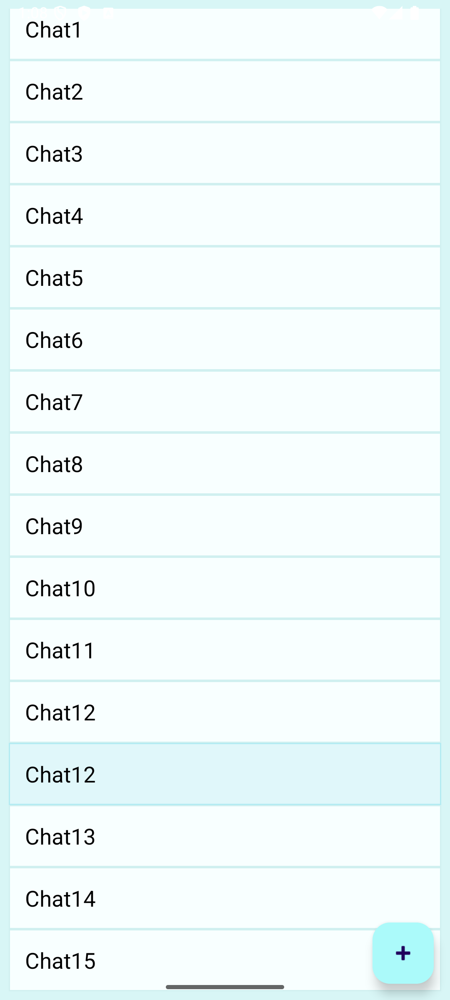
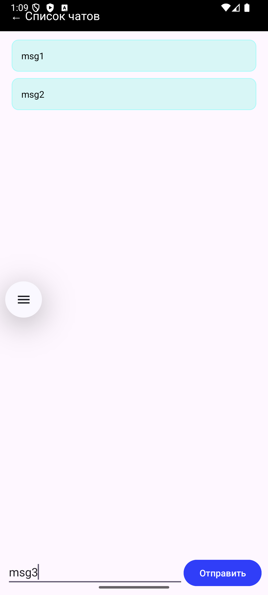
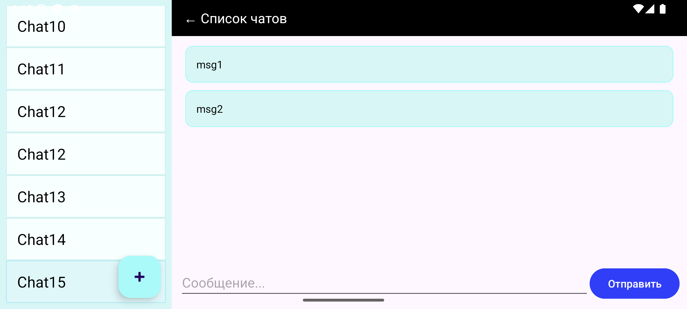

# Мессенджер-клиент

Android-приложение со списком чатов и сообщениями.
Интерфейс адаптирован под смартфоны и планшеты. Данные загружаются с сервера с помощью Retrofit.
В проекте используется архитектура MVVM.

## Скриншоты:

##### Список чатов:

##### Сообщения в чате:

##### Горизонтальная ориентация:

